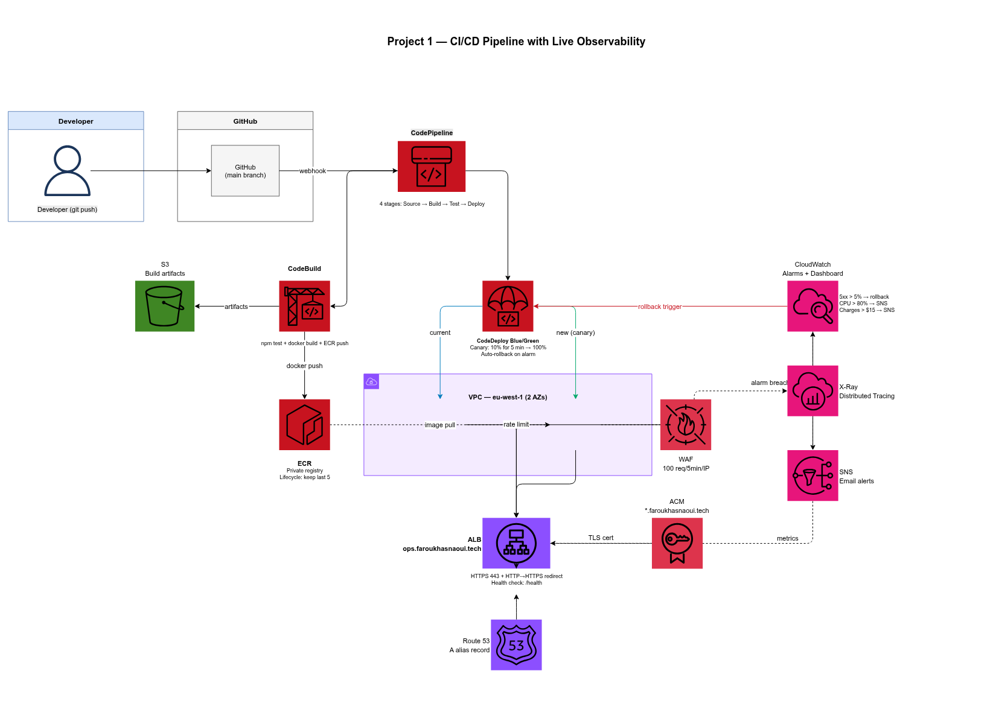

# Project 1 — CI/CD Pipeline with Live Observability

> **Every git push auto-deploys. Every problem auto-alerts. Every metric is visible.**



---

## What this project does

Imagine a factory where every product is inspected automatically before shipping, and if something fails quality control it is rejected without any human involvement. This project does the same for software — every code change is automatically tested, built into a Docker container, deployed to AWS, and monitored in real time. If a deployment degrades performance, the system rolls itself back to the last known good version with zero human involvement.

Live deployment dashboard: **https://ops.faroukhasnaoui.tech/health**

---

## What problem it solves

Manual deployments introduce human error and create bottlenecks. Without observability, problems are discovered by customers before engineers. This architecture eliminates both: deployments are fully automated with a blue/green canary strategy, and a live CloudWatch dashboard surfaces latency spikes and error rates the moment they appear.

---

## Architecture overview

    GitHub (main branch)
            |
            v webhook
      CodePipeline
            |
      +-----+------+
      |            |
    CodeBuild   CodeDeploy (Blue/Green)
      |            |
      |     +------+------+
      |   Blue          Green (new)
      |  (ECS)        (ECS Fargate)
      |            |
      +---- ECR ---+
                  |
                 ALB  <-- ops.faroukhasnaoui.tech (Route 53 alias)
                  |
             CloudWatch + X-Ray

---

## AWS services and why each was chosen

| Service | Purpose |
|---|---|
| **CodePipeline** | Orchestrates the full pipeline: Source to Build to Deploy. Chosen over GitHub Actions alone because it integrates natively with CodeDeploy blue/green ECS deployments. |
| **CodeBuild** | Builds the Docker image and runs automated tests in an isolated, ephemeral environment. No build server to maintain. |
| **CodeDeploy** | Performs blue/green deployment to ECS Fargate with canary traffic shifting (10% for 5 min then 100%). Auto-rolls back on CloudWatch alarm breach. |
| **ECS Fargate** | Serverless container runtime — no EC2 instances to patch, size, or manage. Scales to the task count needed. |
| **ECR** | Private Docker image registry co-located in AWS. Lifecycle policy keeps only the last 5 images, preventing storage creep. |
| **ALB** | Internet-facing HTTPS entry point. Terminates TLS, routes to Fargate tasks, and feeds metrics to CloudWatch for latency and error rate alarms. |
| **CloudWatch** | Dashboards, alarms (5xx rate, CPU, estimated charges), and log groups for CodeBuild and ECS. Single pane of glass for the entire stack. |
| **X-Ray** | Distributed tracing — shows where request latency comes from end-to-end inside the container. |
| **SNS** | Delivers alarm notifications to email when thresholds breach. |
| **S3** | Stores CodePipeline build artifacts. Versioning on, 30-day lifecycle policy. |
| **WAF** | Rate-limits inbound requests at the ALB (100 req / 5 min per IP). Blocks flood attacks before they reach ECS and trigger runaway scaling costs. |
| **IAM** | Least-privilege roles per pipeline stage — CodeBuild can push to ECR but cannot touch Route 53; CodeDeploy can update ECS but cannot read S3 artifacts directly. |
| **Route 53** | A-record alias pointing ops.faroukhasnaoui.tech to the ALB. Health checks feed into the CloudWatch alarm chain. |
| **ACM** | Wildcard certificate *.faroukhasnaoui.tech covers this subdomain at no cost. Attached to the ALB HTTPS listener. |

---

## How to deploy

### Prerequisites

- AWS CLI v2 configured with `aws configure`
- Node.js 18+ and AWS CDK installed: `npm install -g aws-cdk`
- Docker running locally
- CDK bootstrapped in eu-west-1: `cdk bootstrap aws://ACCOUNT_ID/eu-west-1`
- GitHub OIDC role configured (see docs/oidc-setup.md)

### One-command deploy

```bash
cd infra
npm install
cdk deploy --all --require-approval never
```

This deploys all stacks in dependency order:
`EcrStack → EcsStack → PipelineStack → MonitoringStack → WafStack`

After deploy, push any commit to `main` to trigger the full pipeline.

---

## How to destroy

```bash
cd infra
cdk destroy --all
```

Then manually clean up ECR images and the S3 artifacts bucket (CDK cannot delete non-empty buckets):

```bash
# Empty and delete ECR images
aws ecr batch-delete-image \
  --repository-name portfolio-1-app \
  --region eu-west-1 \
  --image-ids "$(aws ecr list-images \
    --repository-name portfolio-1-app \
    --region eu-west-1 \
    --query 'imageIds[*]' \
    --output json)"

# Empty the S3 artifacts bucket before CDK can delete it
BUCKET=$(aws s3 ls | grep portfolio-1-artifacts | awk '{print $3}')
aws s3 rm s3://$BUCKET --recursive
```

> Always destroy after demoing. The ALB and Fargate tasks are the largest ongoing cost drivers.

---

## Cost estimate

See [COST.md](COST.md) for the full itemised breakdown.

**Idle/demo state:** ~$3–6/month
**Active demo (pipeline running, traffic flowing):** ~$5–8/month

Largest cost drivers: ALB ($0.008/LCU-hour), Fargate ($0.04048/vCPU-hour), NAT Gateway ($0.045/hour).

---

## Demo video

🎬 [Watch the 2-minute demo on Loom](#) ← replace with your Loom URL after recording

The video shows:
1. A code push triggering the full pipeline end-to-end
2. The CloudWatch dashboard updating in real time
3. A deliberate `/health` breakage triggering an automatic CodeDeploy rollback

---

## Lessons learned

1. **Blue/green rollback requires a CloudWatch alarm in ALARM state** — CodeDeploy does not inspect the application itself; it relies entirely on the alarm you wire up. Getting the threshold and evaluation period right (2 consecutive datapoints at >5% 5xx rate) took more iteration than expected.

2. **IAM role chaining across pipeline stages is the hardest part to debug** — CodeBuild's role needs ECR push permissions; CodeDeploy's role needs `ecs:UpdateService` and `iam:PassRole`; getting these wrong produces silent failures mid-pipeline that look like networking issues.

3. **CDK bootstrap is region-specific** — forgetting to bootstrap `us-east-1` for stacks that reference global services caused a confusing deploy failure on the first run that took time to trace back to a missing bootstrap stack.

---

## Repository structure

    .
    +-- app/                        # Node.js application
    |   +-- Dockerfile
    |   +-- src/index.ts            # /health and /version endpoints
    |   +-- tests/
    +-- infra/                      # AWS CDK (TypeScript)
    |   +-- lib/
    |       +-- ecr-stack.ts
    |       +-- ecs-stack.ts
    |       +-- pipeline-stack.ts
    |       +-- monitoring-stack.ts
    |       +-- waf-stack.ts
    +-- .github/workflows/
    |   +-- deploy.yml              # GitHub Actions CDK deploy on push to main
    +-- docs/
    |   +-- architecture.png        # Exported from draw.io
    |   +-- architecture.drawio     # Editable source diagram
    |   +-- rollback-runbook.md
    +-- buildspec.yml               # CodeBuild instructions
    +-- appspec.yaml                # CodeDeploy ECS deployment spec
    +-- taskdef.json                # ECS task definition for CodeDeploy
    +-- COST.md
    +-- README.md

---

## Tags applied to all resources

| Key | Value |
|---|---|
| Project | 1 |
| Environment | prod |
| Owner | farouk |
